## Setup

Download

```BASH
wget https://github.com/plantuml/plantuml/releases/download/v1.2025.2/plantuml-1.2025.2.jar
mv plantuml-1.2025.2.jar $HOME/.local/plantuml.jar
```

Then add to your `~/.bashrc` or `~/.zshrc`:

```BASH
alias plantuml='java -jar $HOME/.local/plantuml.jar'
```

# Usage

```BASH
plantuml -o output_dir input_file
plantuml -tsvg input.puml # generates SVG
```

## Basics

All diagrams are written in a text file with the `.puml` extension and wrapped in the following tags:

```plantuml
@startuml
...
@enduml
```



Inside that block, you declare:

- Entities: classes, actors, components, nodes, interfaces, etc.

- Relationships: arrows (->, <--, --|>, etc.)

- Styling & layout: direction, colors, notes, packages, title etc.

## Core Elements Of PlantUML

## C4 System Context Diagram

> What is the system we’re building, who uses it, and what other systems does it interact with?

```plantuml
@startuml
'Must include the C4-PlantUML library for C4_context Diagrams
!includeurl https://raw.githubusercontent.com/plantuml-stdlib/C4-PlantUML/master/C4_Context.puml
' Place this at the top, before elements, renders left to right
LAYOUT_LEFT_RIGHT()

@enduml
```

`Person(identifier, "Display Name", "Description")` — defines an actor/stakeholder

`System_Boundary(identifier, "Display Name", "Description")` — defines a boundary around a system
`System(identifier, "Display Name", "Description")` — defines a system under consideration
`System_Ext(identifier, "Display Name", "Description")` — defines an external system

`Rel(from, to, "Description")` — defines a relationship (with optional label)

`LAYOUT_WITH_LEGEND()` - Part of the C4 styling extensions in C4_Deployment.puml. Auto-generates a legend and cleans up layout spacing

## C4 Container Diagram

### Entities (Participants)

Syntax Description
class Foo A class
interface IBar An interface
actor User An actor (used in sequence or use case diagrams)
component API A component (for system-level views)
package "Controllers" A namespace or logical grouping
